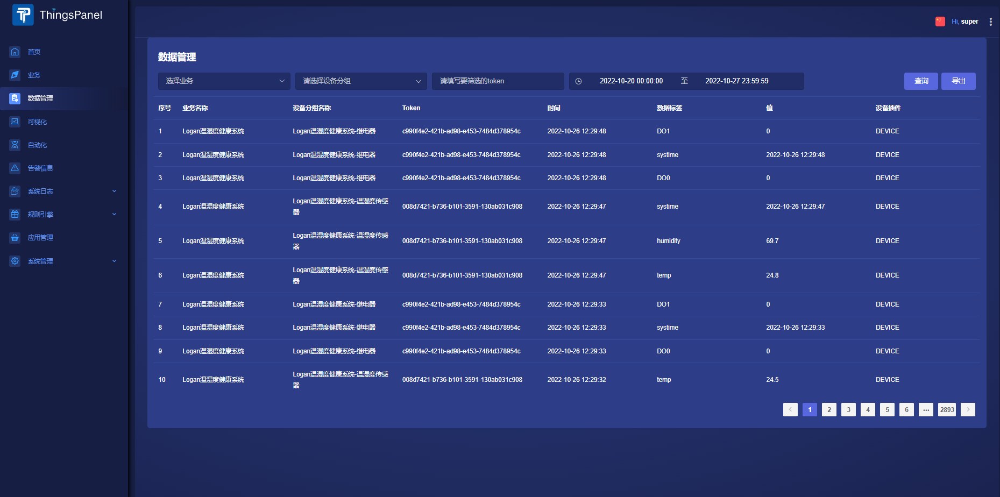
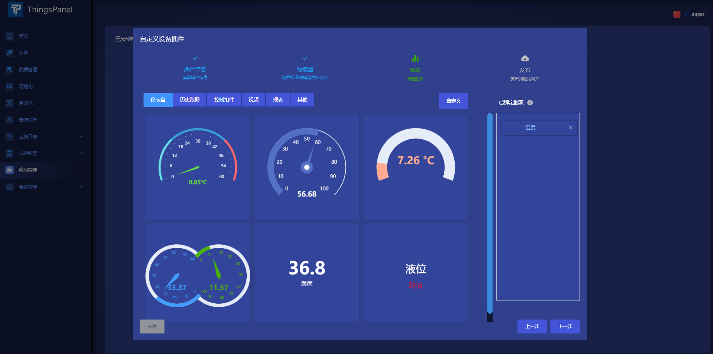

<p style="text-align: center">
    <a href="https://github.com/ThingsPanel/ThingsPanel-Backend-Vue">
        
    </a>
    <a href="">
        
    </a>
    <a href="https://github.com/ThingsPanel/ThingsPanel-Backend-Vue">
        
    </a>
    <a href="LICENSE">
        
    </a>
</p>
# ThingsPanel前端使用说明

本系统采用Golang 微服务架构,一款高性能、高吞吐量、高扩展性的物联网平台! 单机可以支持百万链接,同时支持自定义扩展功能多种协议交互，支持插件化开发!

# 1. 平台描述

物联网核心支撑软件 ・适用所有物联网场景 ・开源

* 通用物联网场景快速实现
* 美观、开源
* 简洁、上手门槛低   
* 功能可无限扩展

## 1.1 功能介绍


## 1.2 在线体验

演示地址：http://dev.thingspanel.cn

测试账号： admin@thingspanel.cn  
测试密码： 123456

[相关技术资料及话题](http://forum.thingspanel.cn/)

# 2. 技术栈

- Backend：Golang(Go 1.17.5)
- Frontend：Vue.js Element-UI （node.js 16.13)
- MQTT Broker：GMQTT
- TSDB: PostgreSQL 14.1

# 3. 环境搭建

## 3.1 ThingsPanel-Go后台环境搭建

[详情查看此链接 —> http://forum.thingspanel.cn/d/10-thingspanel-go](http://forum.thingspanel.cn/d/10-thingspanel-go)

## 3.2 安装依赖
- 下载安装Node.js，推荐版本16.13
- 终端进入项目根目录下，执行命令```npm install```，等待依赖下载完毕

## 3.3 本地运行
- 执行```npm run dev```
- 打开浏览器输入```localhost:8080```即可访问

## 3.4 部署到服务器
- 执行 ```npm run build``` 打包项目
- 打包成功后，会在dist目录下生成打包后的文件，将dist目录里的所有文件上传到服务器的web目录里
- 在服务器上配置nginx
- 配置完后测试配置文件是否正确 ```nginx -t```
- 重新加载配置文件 ```nginx -s reload```
- 在浏览器中输入地址访问

# 4. 运行效果







## 联系我们

[wiki](http://wiki.thingspanel.cn/index.php?title=%E9%A6%96%E9%A1%B5)

论坛：[论坛](http://forum.thingspanel.cn/)

qq群：260150504
